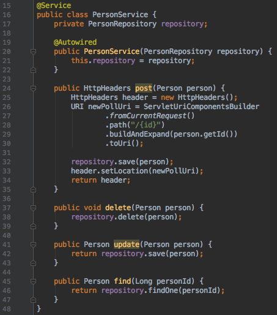

-
# Spring MVC Projects


-
## Model View Controller (MVC)
* An architectural pattern for developing services to be consumed via user interfaces
* The pattern aims to decouple the following concerns into 3 interconnected components
	* Model
		* Class representation of a data relation
	* View
		* Visible interface available to user
		* **Not implemented using Spring technology**
	* Controller
		* Handles incoming requests and supplies outgoing responses
* This decoupling allows easy code reuse and parallel development


-
## MVC Component Diagram


-
## MVC Component Conversation
> `View:` "Hey, controller, the user just told me they want item 4 deleted."

> `Controller:` "Hmm, having checked their credentials, they're allowed to do that... Hey, model, I want you to get item 4 and do whatever you do to delete it."

> `Model:` "Item 4... got it. It's deleted. Back to you, Controller."

> `Controller:` "Here, I'll collect the new set of data. Back to you, view."

> `View:` "Cool, I'll show the new set to the user now."


-
## Model Component
* Synonymous to an `Entity` in Spring context

* Class representation of a data relation
	* Often representative of a single row of a table in the database 


### Value Objects
* Nearly all **value objects** in an MVC archetype will be `Model` objects.
	* A _value object_ is an object representative of an entity whose equality is not based on identity. Rather, two _value objects_ are equal when they have the same encapsulated values, not necessarily being the same object.
	* `String` is an example of a value object in java

	
### Models and Spring-Convention
* When designing an MVC Spring archetype, it is conventional that for every `Entity` class there is a respective
	* Controller
	* Service
	* Repository


-
-
### Example Model Object (Java)
```java
public class Person {
    private long id;
    private String fname;
    private String lname;    

    public Person(long id, String fname, String lname) {
        this.id = id;
        this.fname = fname;
        this.lname = lname;        
    }
    // ... getters and setters omitted for brevity ...
}
```


-
-
### Example Model Object (Database)
 <table> 
  <tr><td>ID</td><td>FNAME</td><td>LNAME</td></tr>
  <tr><td>0</td><td>Leon</td><td>Hunter</td></tr>
  <tr><td>1</td><td>Wilhem</td><td>Alcivar</td></tr>
  <tr><td>2</td><td>Dominique</td><td>Clarke</td></tr>
</table> 


-
## Service Component
* Responsible for performing operations with one or more models.
* Each service operation is considered a _transaction_ by the user.
	* a single transaction can involve multiple operations of insert/update/delete to a database
* Mediates communication between controller and _repository_.
	* A _repository_ is responsible for bridging communication between application and database by performing `CRUD` operations.

-
-
### Designing a Service class
* Services should consume `Repository` objects upon construction
	* This ensures modular testing is possible with mock `Repository` objects
* Services should contain any logic used to complete an incoming request.
* Services should reduce the bloat and maintainence of a `Controller`.


-
-
### Example of Service Class (Java)



-
## Controller Component
* Handles incoming requests, supplies outgoing response
* Responsible for updating and responding to the View
* Operates View-agnostically; Does not need to know anything about the view
* Should not contain  business logic; Rather its behavior should be dependent on the `Service` object provided to it upon construction
* Methods longer than 2 lines should have careful reconsideration!
	* Controller method template:
		1. perform respective service method & get return-value
		2. Construct response with return-value and HTTP status code


-
-
### Example of Controller Class (Java)


